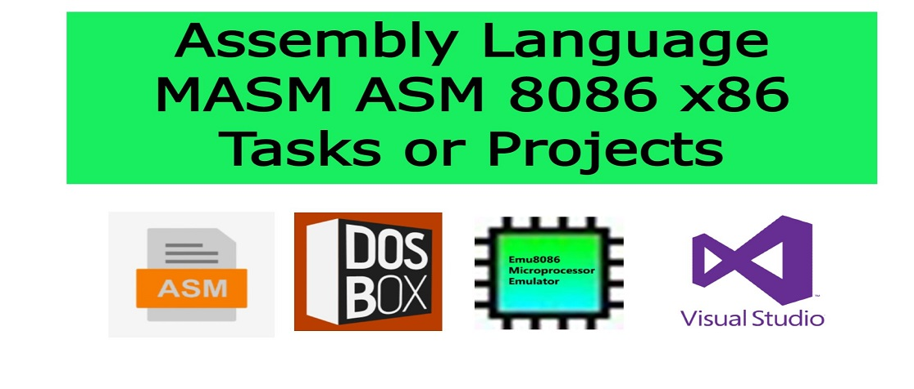

# 8086 Assembly Language Small Programs and Projects
In this Repository we will share the Lastest and Best Assembly Language Small Programs and Projects. We Use 8086 Assembly Language For Creating these Projects.  I hope all of you following and supporting me by sharing my helpful content with your friend and family. Keep supporting me.

# Motivation
We all love to surf the Internet. Most of the times, we come across some cool awesome websites which we tend to bookmark for future use. And I love to say that I'm no exception to this behavior.

Since I have found so many such awesome websites throughout my journey in this vast ocean we call Internet, I would like to share my collection with you all. I hope you will like this cool collection of mine and don't forget to star my repo!

Most of the websites are just for fun and some are very useful for specific purposes. Though I have written brief information about it in front of the link which I hope will grow your curiosity. Enjoy and do share this cool collection with your friends.

## See The Live Demo of My Portfolio Websites
Click this Link : https://abubakarwebdev.github.io/

## See The Live Demo of Our Created Websites
Click this Link : https://abubakarwebdev.github.io/websites/

## See The Live Demo of Our Created Web Application
Click this Link : https://abubakarwebdev.github.io/webapplications/

## Our All Created Web Applications Link
> Our Created [web applications](https://abubakarwebdev.github.io/webapplications/#webapps) is Simple, Clean & Elegent. This is The Best Functionallity that I Provided To My Web Application. All the Web Application Link is provided Below. All of These Web Application are created HTML5 CSS3 Bootstrap 4 Javascript & Jquery. This is Only a FrontEnd Not Backend is Attached With This Web Applications.

|Web Applications                                                                                     |Description                                                              |
|-----------------------------------------------------------------------------------------------------|-------------------------------------------------------------------------|
|[Main Website](https://abubakarwebdev.github.io/webapplications)                                                                                                               | It is The Main Website For Finding All My Javascript Web Applications. Kindly Visit This Website.                                                                               |
|[Library Managment System](https://abubakarwebdev.github.io/webapplications/library-managment-system)                                                                          | A Simple Javascript Application that View, Create, Delete, Search and Update Your Library Records                                                                               |
|[Corona Virus World Map](https://abubakarwebdev.github.io/webapplications/corona-virus-map)                                                                                    | A Simple Javascript Application that Show the All Over the World Map For COVID-19 Cases. It Shows Country Name, Its Total Positive Cases, Total Death Cases and Disease Stage. With the Help of Daily Updatable API.                                                                                                                                           |
|[Online Alarm Clock](https://abubakarwebdev.github.io/webapplications/online-alarm-clock)                                                                                      | A Simple Javascript Application that Set and Stop Your Alarm Clock and it Also Shows Date and Time.                                                                             |
|[Quiz Taker Website](https://abubakarwebdev.github.io/webapplications/quiz-taker-website)                                                                                      | A Simple Javascript Application that Take Quiz From users. user Inputs a name and accepts quiz instructions and then quiz is started. After the starting of quiz timer are also started. when the quiz is end then result is show.                                                                                                                              |
|[Online Api Tester Postman Application](https://abubakarwebdev.github.io/webapplications/api-tester-postman-application)                                                       | A Simple Javascript Application that is very useful for programmer because they sent a different types of request on specific site. So In This App we add "get" and "post" Request For a user.                                                                                                                                                             |
|[Bricks Breaker Ball Game](https://abubakarwebdev.github.io/webapplications/bricks-breaker-ball-game)                                                                          | A Simple Javascript Application that you Just break bricks with your ball. Easiest and simplest brick breaker game for everyone                                                 |
|[Online Collage GPA Calculator](https://abubakarwebdev.github.io/webapplications/online-gpa-calculator)                                                                        | A Simple Javascript Application that Calculate Your University, Collage GPA According to the given criteria.                                                                    |
|[News Website Using Api](https://abubakarwebdev.github.io/webapplications/online-news-website)                                                                                 | A Simple Javascript Application that uses a Simple News Api and Make a Auto Posted News Content in a website                                                                    |
|[Notes Maker Website](https://abubakarwebdev.github.io/webapplications/online-notes-taker-website)                                                                             | A Simple Javascript Application that View, Create, Update, Delete and Search Your created Notes                                                                                 |
|[Javascript Analouge Clock](https://abubakarwebdev.github.io/webapplications/javascript-analouge-clock)                                                                        | A Simple Javascript Application that show a awesome analouge clock with neumorphism effect                                                                                      |
|[Javascript Math Calculator](https://abubakarwebdev.github.io/webapplications/online-javascript-calculator)                                                                    | A Simple Javascript Application That Calculates a Mathematical Expression and Handles Logical and Syntax Errors Correctly.                                                      |
|[Javascript Simple Dice Game](https://abubakarwebdev.github.io/webapplications/online-javascript-dice-game)                                                                    | A Simple Javascript Application In Which two player are play with each other using dice. This app randomly created the number of dice and which player that got higher number on dic so this is winner.                                                                                                                                                          |
|[Online Javascript Dictionary Application](https://abubakarwebdev.github.io/webapplications/online-javascript-dictionary-application)                                          | A Simple Javascript Application that Shows a Defination, Synonyms & Antonyms of a word that user enters in application                                                          |
|[Javascript Online CV Screener](https://abubakarwebdev.github.io/webapplications/online-cv-screening-javascript-application)                                                   | A Simple Javascript Application that Screens your C.Vs Job Applier and It Also Provide a checkmark For a Accept a Applier on your Company                                       |
|[Online Todo List Application](https://abubakarwebdev.github.io/webapplications/online-javascript-todo-list-application)                                                       | A Simple Javascript Application that Add, Delete, Update and Search your Task and Also You Mark Your Custom Tasks When you complete It.                                         |

## Our All Created Responsive Websites Link
> There Are Many [Websites](https://abubakarwebdev.github.io/webapplications/#websites) That I Created. This is a Big List and I create many websites for my clients and many ther website for my personal use and for my hobby. Web Development is not my work. It is my passion and If You want see my create web applications so you easily see my all Web Application. I created This Websites With Pure HTML CSS & JS and Many Other Websites that I created is made with New Technology Like SaaS Bootstrap 5 Jquery PHP MySql and Much More. All The Websites Link is Given Below

|Responsive Websites                                                                                  |Description                                                              |
|-----------------------------------------------------------------------------------------------------|-------------------------------------------------------------------------|
|[Main Website](https://abubakarwebdev.github.io/websites)                                                                                                                      | It is The Main Website For Finding All My Created Lsit of Responsive, creative Websites. Kindly Visit This Website.                                                             |
|[Website # 1](https://abubakarwebdev.github.io/websites/pure-html5-css3-landing-page-template-1)                                                                               | It is the first website that I created in my life with pure html css only.                                                                                                      |
|[Website # 2](https://abubakarwebdev.github.io/websites/pure-html5-css3-landing-page-template-2)                                                                               | It is the Second website that I created in my life with pure html css only.                                                                                                     |
|[Website # 3](https://abubakarwebdev.github.io/websites/pure-html5-css3-landing-page-template-3)                                                                               | It is the Third website that I created in my life with pure html css only.                                                                                                      |
|[Website # 4](https://abubakarwebdev.github.io/websites/pure-html5-css3-landing-page-template-4)                                                                               | It is the Fourth website that I created in my life with pure html css only.                                                                                                     |
|[Website # 5](https://abubakarwebdev.github.io/websites/pure-html5-css3-landing-page-template-5)                                                                               | It is the Fifth website that I created in my life with pure html css only.                                                                                                      |
|[Website # 6](https://abubakarwebdev.github.io/websites/pure-html5-css3-landing-page-template-6)                                                                               | It is the Sixith website that I created in my life with pure html css only.                                                                                                     |
|[Website # 7](https://abubakarwebdev.github.io/websites/pure-html5-css3-landing-page-template-7)                                                                               | It is the Seventh website that I created in my life with pure html css only.                                                                                                    |
|[Website # 8](https://abubakarwebdev.github.io/websites/pure-html5-css3-landing-page-template-8)                                                                               | It is the Eight website that I created in my life with pure html css only.                                                                                                      |
|[Website # 9](https://abubakarwebdev.github.io/websites/pure-html5-css3-landing-page-template-9)                                                                               | It is the Nineth website that I created in my life with pure html css only.                                                                                                     |
|[Website # 10](https://abubakarwebdev.github.io/websites/pure-html5-css3-landing-page-template-10)                                                                             | It is the Tenth website that I created in my life with pure html css only.                                                                                                      |
|[Website # 11](https://abubakarwebdev.github.io/websites/pure-html5-css3-landing-page-template-11)                                                                             | It is the Animated Car Website That I created With Pure HTML & CSS Only.                                                                                                        |
|[Website # 12](https://abubakarwebdev.github.io/websites/pure-html5-css3-website-template-1)                                                                                   | It is the Best full website that I created with pure html css only.                                                                                                             |
|[Website # 13](https://abubakarwebdev.github.io/websites/pure-html5-css3-website-template-2)                                                                                   | It is the Best Website In My List Because I create this website On My Birthday For Countdown of My Birthday.                                                                    |
|[Website # 14](https://abubakarwebdev.github.io/websites/pure-html5-css3-website-template-3)                                                                                   | It is the Best Website For Blooging In My List Because I create this website with new technology like Bootstrap 4, SaaS and JQuery.                                             |
|[Website # 15](https://abubakarwebdev.github.io/websites/pure-html5-css3-website-template-4)                                                                                   | It is the Best Website For Blooging In My List Because I create this website with new technology like Bootstrap 4, SaaS and JQuery.                                             |
|[Website # 16](https://abubakarwebdev.github.io/websites/pure-html5-css3-website-template-5)                                                                                   | It is the best Light website that I create with new css framework that is Tailwind CSS and also use Tailblocks.                                                                 |
|[Website # 17](https://abubakarwebdev.github.io/websites/pure-html5-css3-website-template-6)                                                                                   | It is the best Light website that I create with new css framework that is Tailwind CSS and also use Tailblocks. 

# ▀▄▀▄▀▄ [ Follow Me on ] ▄▀▄▀▄▀
➡️ Facebook:  https://www.facebook.com/techmemories/ 

➡️ Twitter:  https://www.twitter.com/techmemorise/ 

➡️ Instagram: https://www.instagram.com/techmemorise/ 

➡️ Youtube: https://www.youtube.com/channel/UCrF1DtyIAwkLPLm6kKYlTQA

➡️ Web Devlopment Blog: https://techmemorise.blogspot.com/ 

➡️ Tech Blog: https://readyforinfo.blogspot.com/

    <b><a href="#employees-managment-system">↥ Back To Top</a></b>

